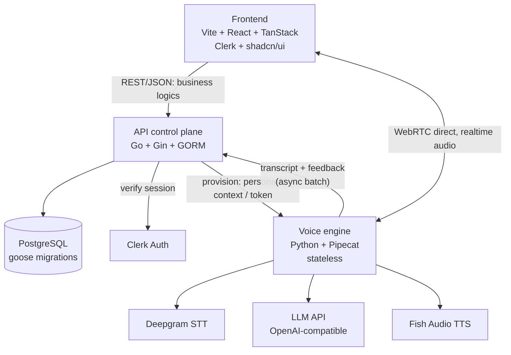
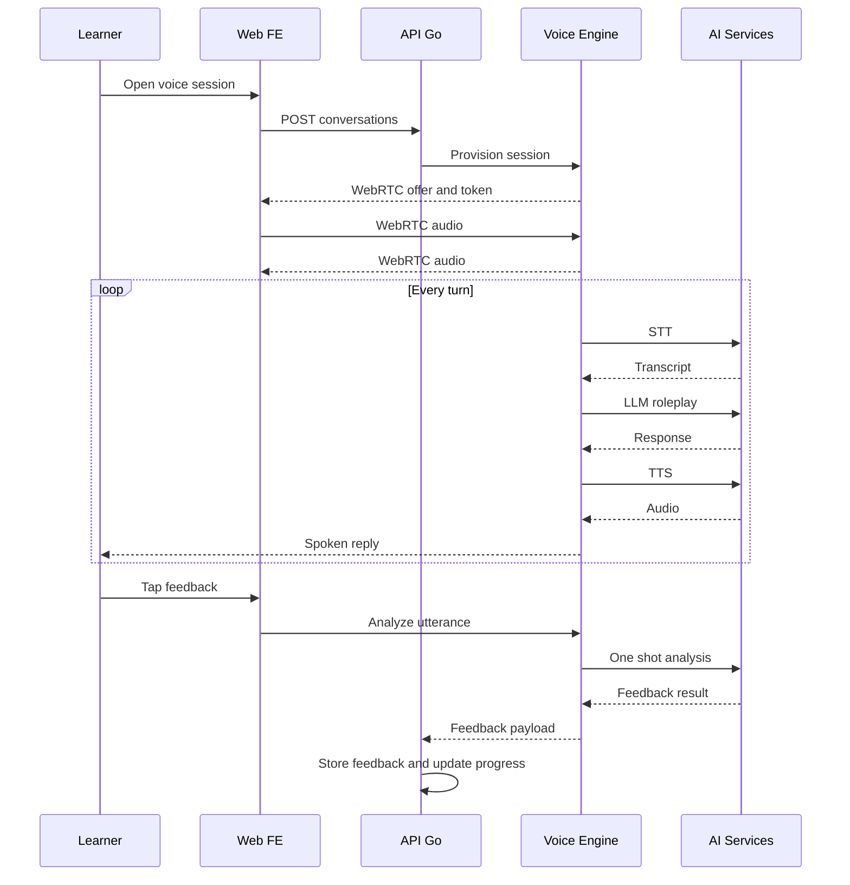

# 🎙️ EngFlex — AI English Learning Platform

<div align="center">
  
</div>

<p align="center">
  <strong>Learn from content. Speak with AI. Track your progress.</strong>
</p>

<p align="center">
  
  
  
  
</p>

---

> **EngFlex is under active development.** Graduation project (team of 3) unifying
> dictation/shadowing practice and AI voice conversation around one learner
> profile and shared data layer. See [Roadmap](#roadmap) for scope.

---

## Tech Stack

| Layer | Technology |
|-------|-----------|
| **Frontend** | Vite + React 19, TypeScript, TanStack Start/Router/Query/Store, shadcn/ui + Tailwind CSS |
| **Auth** | Clerk Authentication |
| **Voice Client** | Pipecat JS client over WebRTC, direct FE ↔ voice engine (audio never proxies through Go) |
| **API Backend** | Go + Gin + GORM |
| **Database** | PostgreSQL, Goose migrations (SQL is the only schema mechanism — never AutoMigrate) |
| **Contracts** | tygo-generated TypeScript (Go DTOs are the source of truth) |
| **Speech Pipeline** | Python + Pipecat (uv-managed, stateless) |
| **STT** | Deepgram |
| **LLM** | OpenAI-compatible API |
| **TTS** | Fish Audio (per-persona gender voice selection) |
| **Pronunciation** | Acoustic scoring on the analyze path |
| **i18n** | Paraglide + inlang message format, locales `vi` (default) + `en` |
| **Mocks** | mockery v3 (generated only) |
| **API Docs** | Swagger |

---

## Key Features

| Feature | Description |
|---------|-------------|
| **Real-time voice chat** | Deepgram STT → LLM → Fish Audio TTS over WebRTC (Pipecat) |
| **Free talk + roleplay** | Casual Flexi tutor or fixed personas (prompt-only, no hidden state) with boundary rules + live off-topic redirect |
| **On-demand feedback** | Per-turn analysis (grammar spans, relevance, alternatives, coaching tip) — async, never pauses the conversation |
| **Pronunciation scoring** | Acoustic assessment attached to analyzed turns |
| **Lessons** | Reading + writing (dictation engine), reusable across modules |
| **Video side-quests** | Self-selected video dictation + shadowing |
| **Vocabulary** | Save words from lessons/videos/conversations + manual add, basic SRS |
| **Progress** | Content list ordered by completion status (unfinished first) |
| **Onboarding/profile** | Level, goals, interests, study time → drives persona/context selection |
| **Gendered TTS voices** | Voice persona based on gender |
| **EN/VI interface** | Cookie-strategy locale, Vietnamese default |

---

## Architecture Overview

> Diagrams below are Mermaid sources. To get the hand-drawn look, paste any
> block into Excalidraw via its diagram tool (Mermaid-to-Excalidraw import).



### Voice Session Lifecycle



---

## Project Structure

```
engflex-ultimate/
├── apps/api/                       # Go control plane (Gin + GORM) — see apps/api/README.md
│   ├── cmd/server/main.go          # Entrypoint: wires config + router only
│   ├── config/                     # Auth, cors, database, log, server, voice
│   ├── internal/
│   │   ├── common/                 # AppError, ApiResponse envelope, enums, limits
│   │   ├── database/
│   │   │   ├── migrations/         # Goose SQL — source of truth (one migration per table)
│   │   │   ├── models/             # GORM structs + TableName() (no gorm.Model)
│   │   │   └── repositories/       # One repo per table + mocks/
│   │   ├── logger/                 # slog setup (request_id + user_id in ctx)
│   │   ├── modules/<domain>/       # attempts, conversations, lessons, profiles, scenarios, videos, vocabulary
│   │   │   ├── module.go           # RegisterRoutes — wiring only
│   │   │   ├── controllers/        # Gin handlers, no SQL
│   │   │   ├── services/           # Business logic, returns *Model + error
│   │   │   └── dtos/requests|responses  # Wire DTOs (tygo inputs)
│   │   ├── server/middleware/      # RequireAuth, RequestID, RequestLogger, Recovery
│   │   └── utils/                  # Map/MapSlice, pagination, IDs
│   ├── tygo.yaml                   # Go DTOs → packages/contracts
│   └── Makefile                    # migrate, mocks, contracts, swagger
│
├── apps/voice/                     # Python Pipecat engine (uv-managed, stateless) — see apps/voice/README.md
│   ├── src/
│   │   ├── app/                    # Runner routes + session schemas
│   │   ├── pipeline/               # STT/LLM/TTS factories, tasks, handlers
│   │   ├── transcript/             # Capture + analyze (feedback, pronunciation)
│   │   ├── clients/                # Go callbacks (turn batch ingest)
│   │   ├── prompts.py              # Free-talk + roleplay templates (engine owns them)
│   │   ├── bot.py                  # Pipeline entry point
│   │   └── config.py               # Role-named settings (stt/llm/voice, never vendors)
│   ├── scripts/                    # redteam_roleplay.py, make_fake_mic_audio.py
│   ├── tests/                      # Per-feature suites (pytest, 120+ tests)
│   └── pyproject.toml              # uv deps (torch CPU index)
│
├── apps/web/                       # TanStack Start frontend — see apps/web/README.md
│   ├── src/
│   │   ├── routes/                 # Directory convention (_app/route.tsx, _app/<domain>/…)
│   │   ├── features/<domain>/      # attempts, dashboard, dictation, lessons, onboarding, …
│   │   ├── components/common|layout|ui  # Shared + shadcn primitives
│   │   ├── app/                    # APP_ROUTES + API_ROUTES (only URLs allowed)
│   │   ├── lib/                    # api.ts envelope client, auth-guard, utils
│   │   └── paraglide/              # Generated-only i18n output, never hand-edit
│   ├── messages/{en,vi}/<domain>.json  # inlang sources (vi is base locale)
│   └── scripts/check-conventions.mjs   # Message ids, dynamic keys, hardcoded URLs
│
└── packages/contracts/             # Generated TS (tygo output) + hand-written index.ts barrel
```

---

## Installation

### Prerequisites

| Tool | Version | Purpose |
|------|---------|---------|
| [Go](https://go.dev/dl/) | >= 1.25 | API backend |
| [uv](https://docs.astral.sh/uv/) | latest | Voice engine deps + runner |
| [Node.js](https://nodejs.org/) | >= 20 | Web frontend |
| [pnpm](https://pnpm.io/) | >= 9 | Monorepo workspaces |
| [PostgreSQL](https://www.postgresql.org/) | 15+ | Database |
| [goose](https://github.com/pressly/goose) | v3 | Migrations |
| [mockery](https://vektra.github.io/mockery/) | v3 | Repo mocks |

---

## Environment Variables

Each service reads its own `.env` — copy from `.env.example` and fill in values
(never commit real keys):

| Service | Notable keys |
|---------|--------------|
| API (`apps/api`) | `DATABASE_URL`, Clerk keys, voice-engine URL + internal secret |
| Voice (`apps/voice`) | `STT_API_KEY`, `LLM_API_KEY` / `LLM_BASE_URL` / `LLM_MODEL`, `TTS_API_KEY`, `VOICE_MODEL`, `MALE_VOICE_ID` / `FEMALE_VOICE_ID`, `INTERNAL_SECRET` |
| Web (`apps/web`) | Clerk publishable key, API base URL |

---

## Running Locally

### 1. Database + migrations

```bash
cd apps/api
make migration-up          # goose up, DATABASE_URL from .env
```

### 2. API (Go control plane)

```bash
cd apps/api
go run ./cmd/server
```

Swagger UI: `/swagger` (regenerate with `make swagger`).

### 3. Voice engine (Python + Pipecat — always via `uv run`)

```bash
cd apps/voice
uv run python src/bot.py   # Go never proxies audio — FE connects WebRTC directly here
```

### 4. Web frontend

```bash
pnpm install               # from repo root (workspace)
pnpm --filter web dev      # Vite dev server on :3000
```

Open http://localhost:3000 in your browser.

### Gates (run before every change)

```bash
# API
cd apps/api && go test ./... -count=1 && go vet ./... && test -z "$(gofmt -l internal/)"

# Voice
cd apps/voice && uv run pytest -q && uv run ruff check src tests

# Web
cd apps/web && pnpm check && pnpm exec tsc --noEmit && pnpm check:conventions && pnpm build
```

---

## API Development Commands

```bash
cd apps/api
make migration-create name=...  # new goose migration (pre-deploy: edit in place + down/up)
make migration-up / migration-down
make mocks                       # regenerate mockery mocks
make contracts                     # tygo generate → packages/contracts
make swagger                       # swag init -g cmd/server/main.go
```

<!-----

## Deployment

Demo-oriented (graduation project): services run on team hardware, exposed via
Cloudflare Tunnel (HTTPS without opening modem ports). Keep a pre-recorded demo
as backup for defense day in case of network issues.-->

<!-----

## Roadmap

### MVP scope (per spec)

* [ ] Onboarding/profile form (level, goals, interests, study time)
* [ ] Lessons — reading + writing on the dictation engine
* [ ] Video side-quests — dictation + shadowing
* [ ] AI voice — free talk + fixed persona roleplays (prompt-only)
* [ ] Per-turn async feedback + pronunciation scoring
* [ ] Vocabulary — save from lessons/videos/conversations + basic SRS
* [ ] Progress — completion-ordered content list

### Stretch

* [ ] Auto takeaway summary at session end
* [ ] Objective tracking inside roleplays
* [ ] Streaks, skill trends, personalized recommendations
* [ ] Admin/CMS content UI (seed via script/DB for now)
```-->
